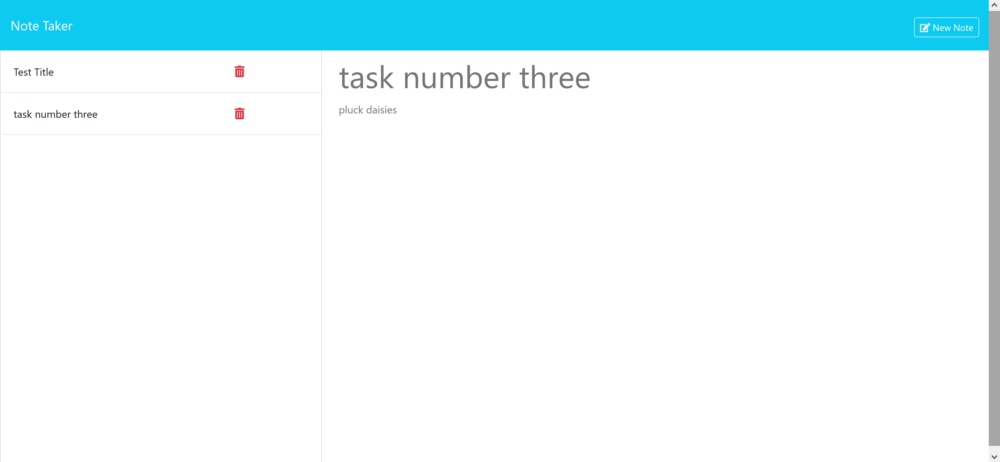

# note-taker-supreme

## Description
- note-taker-supreme is an app that allows you to create notes on whatever you like, whether it be
  tasks, ideas, etc and also allows you to delete them as well

## Installation
- For Users:
   - Note-taker-supreme can be accessed at the live URL.
- For Developers:
   - Clone the repository and ensure that the uniqid and Express.js packages are installed.

## Screenshot

## Technologies Used
- heroku
- HTML
- CSS
- JavaScript
- Node.js
- Express.js
- NPM uniqid

## Link to Deployed Site

https://note-taker-supreme-05d95fb0f9e2.herokuapp.com/

## License

MIT license
